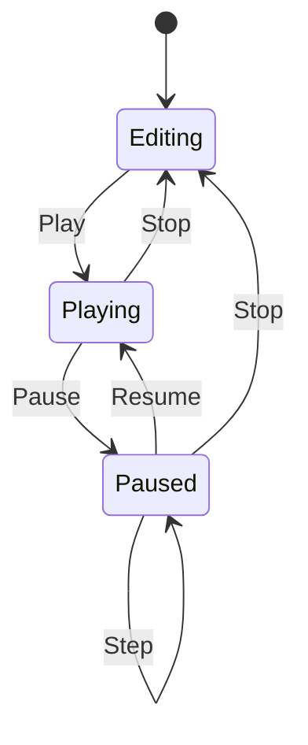

> 这是一篇独立的阶段开发日志，记录当前版本的架构整理、功能实现、验证结果和后续计划。原始开发日志保持不变。

## 项目简介

LancelotEngine 是一个使用 C++20、OpenGL 3.3、GLFW、GLAD、GLM 和 Dear ImGui 开发的实时渲染器与可视化编辑器原型。

项目的目标不是立即复刻 Unity 或 Unreal Engine，而是逐步实现渲染、场景、资源、模拟、编辑器和运行时系统，理解一个引擎从底层图形 API 到上层工具链的完整数据流。

- 项目状态：Active Development
- 主要平台：Windows 10 / 11
- 语言标准：C++20
- 图形 API：OpenGL 3.3 Core
- 编辑器 UI：Dear ImGui 1.92.6 Docking
- 构建工具：CMake、Ninja、Visual Studio 2022

## 本阶段目标

本阶段重点是把已有功能整理成更清晰的引擎结构：

1. 将模型、平台、粒子、水体和烟雾统一为可编辑对象；
2. 将引擎运行时、编辑器和项目脚本拆分；
3. 建立 Play、Pause、Step、Stop 运行时会话；
4. 增加对象选择、层级、复制、删除和 Gizmo 操作；
5. 将编辑器拆分成多个模块化窗口；
6. 增加稳定的主题、字体和语言系统；
7. 使用自动化测试验证场景、资源、运行时和编辑器边界。

## 当前整体架构

```text
项目描述文件
      │
      ▼
EngineApplication
 ├── LancelotEngine
 │    ├── Window / Input
 │    ├── Renderer / OpenGL
 │    ├── AssetLibrary / Resource Cache
 │    ├── Scene / SceneObject
 │    ├── SimulationRuntime
 │    └── RuntimeSession
 ├── LancelotEditor
 │    ├── Hierarchy
 │    ├── Inspector
 │    ├── Resource Browser
 │    ├── Profiler / Output
 │    └── Smoke / Water Lab
 └── LancelotProjectScripts
```

核心原则是：引擎负责数据和运行时能力，编辑器负责编辑操作和显示，项目脚本负责具体玩法逻辑。

## 模块拆分

### LancelotEngine

引擎库不依赖 Dear ImGui 或 ImGuizmo，主要提供窗口、输入、相机、渲染器、Shader、Mesh、Material、Texture、OBJ/glTF 加载、Scene、粒子、烟雾、水体、运行时会话和项目序列化。

这样可以在没有编辑器的情况下构建 LancelotPlayer。

### LancelotEditor

编辑器模块负责 Dear ImGui 初始化、ImGuizmo 变换工具、Docking 布局、层级对象管理、Inspector 属性编辑、资源浏览、性能统计、输出日志，以及粒子、烟雾和水体实验面板。

编辑器不直接拥有场景数据，而是通过引擎接口修改 Scene。

### LancelotProjectScripts

项目脚本单独编译，用于绑定 Sandbox 项目中的 C++ 行为。

当前流程为：

```text
项目脚本 → C++ 编译 → 脚本注册表 → 绑定 SceneObject
         → Play 创建运行时副本 → 脚本更新 → Renderer 绘制
```

目前已经支持指定主角对象，并在 Play 后使用 WASD 控制角色。脚本仍需重新编译，暂未实现热重载。

## 当前编辑器能力

### 场景对象化

当前场景中的主要内容都已经统一为 SceneObject：

- OBJ 模型；
- glTF 场景；
- 骨骼模型；
- CPU 粒子发射器；
- GPU 粒子发射器；
- 2D 烟雾；
- 3D 水体；
- 平台；
- 点光源和聚光灯；
- 相机；
- 环境。

对象具有稳定 ID、名称、可见性、父对象、Transform 和对应类型数据。

### Hierarchy

Hierarchy 支持查看场景对象树、选择对象、拖拽建立父子关系、移动到场景根节点、复制对象及其子树、删除对象及其子树，以及添加不同类型的场景对象。

父子关系会检查循环、缺失父对象和不支持的剪切变换。

### Inspector

Inspector 支持修改对象名称、可见性、父对象、位置、旋转、缩放、局部坐标、吸附参数、模型材质、C++ 行为脚本、主角状态、角色移动速度、相机跟随，以及粒子、水体和烟雾参数。

### Gizmo

场景视图支持三维 Gizmo：

- Q：移动；
- W：旋转；
- E：缩放；
- 世界坐标轴和局部坐标轴切换；
- 鼠标拖动坐标轴；
- 移动、旋转和缩放吸附；
- 选中对象的射线拾取。

变换结果会经过父子矩阵分解和 TRS 检查，避免把无法表示的剪切结果写回对象 Transform。

## 运行时会话



运行时开始时会创建场景副本。编辑场景保留在编辑器中，Play 期间运行时对象可以更新，Pause 会冻结动画、粒子和流体模拟，Step 只推进一个模拟步骤，Stop 后丢弃运行时修改。

## 资源与场景系统

当前资源流程为：

```text
项目资源文件 → Resource Browser → Importer
             → AssetLibrary / Resource Cache
             → SceneObject 资源引用 → Renderer
```

目前支持 OBJ、glTF、GLB、骨骼模型、项目资产目录浏览、资源缓存、拖拽模型到 Scene View、资源绑定和场景引用保存。

场景保存包含对象稳定 ID、Transform、父子关系、对象类型、资源路径和相关参数，并生成备份文件。

## 粒子、烟雾和水体

### 粒子系统

当前支持 CPU 粒子、GPU 粒子、发射速率、生命周期、速度、重力、起始/结束大小、火花/烟雾/雪/喷泉预设、局部空间、运行时暂停和 GPU 槽位统计。

粒子发射器已经是场景对象，可以被选择、移动、旋转、缩放、复制和删除。

### 2D 烟雾

烟雾实验室包含密度场、速度场、压力场、散度、障碍物、平流、压力迭代、自动喷烟、鼠标注入、鼠标绘制障碍和参数调节。

### 3D 水体

水体实验室包含水体粒子、表面重建、三角形统计、重力、压力、黏度、折射、Fresnel、法线、环境反射、浅水边缘泡沫，以及暂停、重置、注水和单步模拟。

这部分仍然是实验性实现，不应视为完整的工业级流体系统。

## 编辑器主题和语言系统

本阶段新增独立的编辑器主题模块和语言模块。

主题采用象牙白背景、深棕色文字、琥珀橙按钮、橙色选中状态、暖灰色边框、绿色拖放目标、更大的圆角和控件间距，并继续使用 20px 微软雅黑。

编辑器顶部提供简体中文和 English 切换。语言偏好保存到编辑器本地配置，下次启动会读取上次选择。窗口使用固定 ImGui ID，因此切换语言不会破坏停靠布局。

对象名称、资产文件名和场景数据不参与翻译。资源导入器产生的原始错误信息保留原文，便于排查底层问题。

## 撤销、重做与保存

当前编辑器支持：

- 64 步场景历史；
- Ctrl+Z 撤销；
- Ctrl+Y 重做；
- 对象复制、删除和 Transform 历史；
- 稳定对象 ID；
- 场景保存；
- 保存前的备份；
- 资源引用持久化；
- 父子关系保存；
- 运行时修改与编辑场景隔离。

## 当前验证结果

本阶段新增语言和主题测试后，当前测试总数为 8 项：

- EditorLocaleTests；
- SceneEditorTests；
- SceneWorkflowTests；
- PlaySessionTests；
- RuntimeSessionTests；
- AssetsRuntimeTests；
- ProjectTests；
- EngineBoundaryTests。

最近一次 Debug 构建结果：

```text
100% tests passed, 0 tests failed out of 8
```

验证内容包括中文翻译和英文回退、窗口 ID 稳定性、格式化字符串参数、语言偏好保存、暖色主题、对象层级、运行时会话、粒子/水体/烟雾、项目路径以及引擎与编辑器边界。

## 当前限制

项目仍然是引擎原型，主要限制包括：

- 部分外部资产格式仍不完整；
- glTF 多材质、动画片段混合和材质扩展仍需完善；
- 粒子排序、软粒子和透明物体排序还不完整；
- 流体系统仍以学习和实验为主；
- 缺少完整的 3D 流体表面重建和高性能邻居搜索；
- 角色碰撞、重力、地面检测和完整玩法层尚未建立；
- C++ 脚本暂不支持热重载；
- 编辑器缺少更完善的快捷键配置、对象搜索和保存提示；
- 资产导入器错误处理和进度反馈仍可加强；
- 当前主要验证平台是 Windows 和 Visual Studio。

## Roadmap

下一阶段建议按照以下顺序推进：

1. 完善编辑器基础体验：快捷键、状态栏、保存提示、错误提示和对象搜索；
2. 稳定 glTF 多网格、多材质、动画片段和材质资源管理；
3. 完善透明渲染、粒子排序和软粒子；
4. 增加角色碰撞、重力、地面检测和基础玩法组件；
5. 将 2D 烟雾模拟整理成独立的可复用 Simulation 模块；
6. 增加 GPU 流体实验和更稳定的水体表面重建；
7. 增加资源依赖、项目设置和场景保存提示；
8. 建立 Player 与编辑器预览之间的配置共享；
9. 增加 GPU 时间统计和渲染调试视图。

## 开发中的思考

当前项目最重要的变化，是从“不断增加渲染效果”转向“建立可维护的引擎结构”。

渲染器解决如何把数据画出来，编辑器解决如何修改这些数据，运行时解决数据如何在一帧一帧的更新中产生行为。三者必须通过清晰接口连接，否则功能越多，耦合就越严重。

后续开发会优先考虑数据所有权、模块修改边界、编辑模式和运行模式隔离、资源引用保存、编辑器操作撤销，以及一个功能能否在编辑器和 Player 中复用。

## 更新日志

### 2026-09-30｜编辑器主题、语言和架构整理

- 新增独立的编辑器主题模块；
- 将原有黑蓝色界面改为象牙白、深棕和琥珀橙配色；
- 保留并使用 20px 微软雅黑；
- 新增简体中文和 English 语言切换；
- 保存编辑器语言偏好；
- 为菜单、层级、属性、资源、性能、粒子、水体和烟雾界面加入翻译；
- 使用稳定 ImGui ID，避免语言切换破坏窗口停靠布局；
- 新增 EditorLocaleTests；
- 完成 Debug 构建并通过全部 8 项测试；
- 在编辑器窗口中确认中文界面、暖色主题、场景视图和性能面板正常显示。

### 2026-09-29｜场景对象化与编辑器运行时闭环

- 将模型、平台、粒子、水体、烟雾、光源、相机和环境统一纳入场景对象；
- 完善 Hierarchy、Inspector 和 Resource Browser；
- 增加对象选择、复制、删除、重命名和父子层级操作；
- 增加 Q/W/E 三维移动、旋转和缩放 Gizmo；
- 增加 Transform 吸附和父子变换检查；
- 增加运行时场景副本；
- 完成 Play、Pause、Resume、Step 和 Stop；
- 支持将 C++ 项目脚本绑定到主角对象；
- 支持 Play 后使用 WASD 控制主角；
- 增加场景历史、Undo、Redo、稳定 ID 和保存备份。

### 2026-09-28｜完成 OpenGL 渲染学习主线

- 完成从三角形、VAO、VBO、EBO 到模型和纹理的基础学习；
- 完成摄像机、深度测试、光照、法线、法线贴图和材质；
- 完成 PBR、IBL、阴影、HDR、Bloom 和后处理；
- 完成 Instancing、glTF、骨骼动画和 GPU Skinning；
- 完成基础粒子、2D 烟雾和 3D 水体实验；
- 整理 CPU、GPU、Framebuffer、后处理和资源缓存的数据流；
- 明确 OpenGL 学习主线与 LancelotEngine 编辑器主线之间的关系。

---

后续日志继续记录新增能力、模块边界、开发问题、解决方案，以及修改对渲染管线、资源系统、场景系统和运行时产生的影响。
