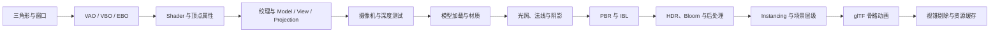
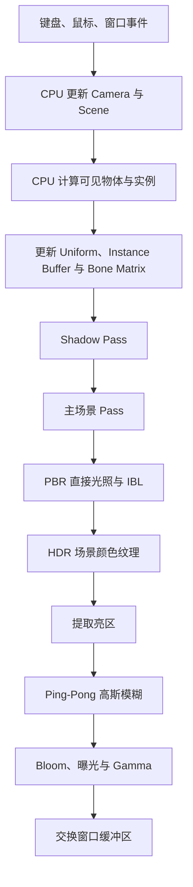
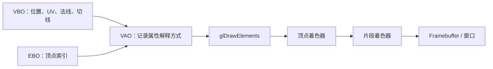
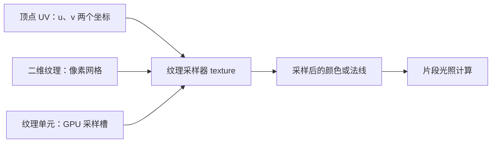
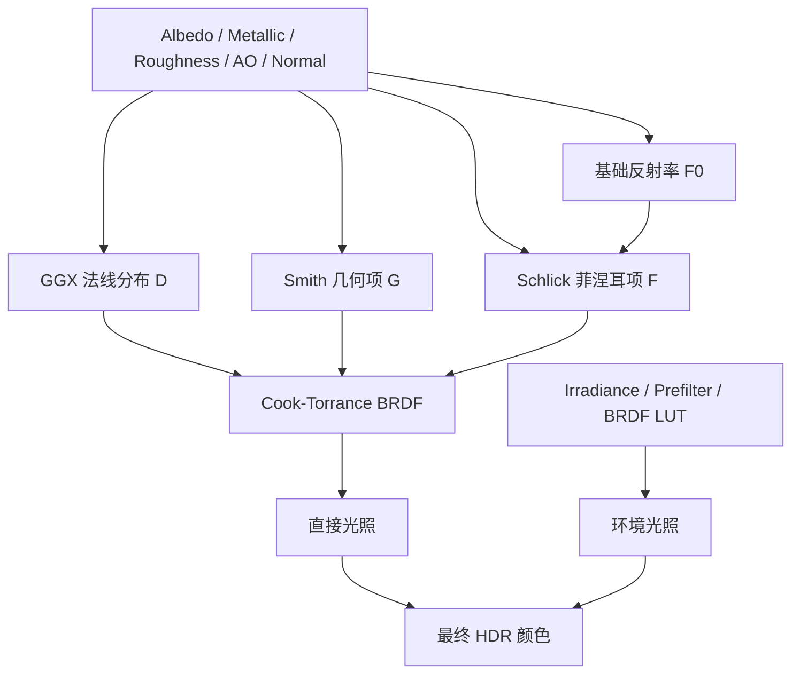
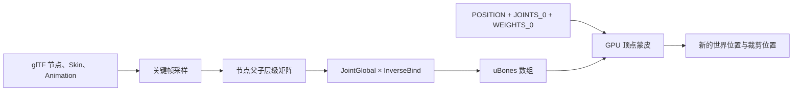

> 这是一篇持续更新的开发日志，用于记录 LancelotEngine 从渲染底层、资源系统到可视化编辑器的演进过程。

## 项目简介

**LancelotEngine** 是一个使用 **C++、OpenGL 和 Dear ImGui** 开发的轻量级 2D 引擎与可视化编辑器原型。

项目目前面向课程设计、技术学习和原型验证。它还不是成熟的商用游戏引擎，但已经开始形成由引擎底层、编辑器界面、项目管理、资源系统、场景序列化和脚本运行时组成的基本结构。

- **项目状态：** Active Development
- **项目仓库：** [LancelotElimit/2D-Engine](https://github.com/LancelotElimit/2D-Engine)
- **主要平台：** Windows 10 / 11
- **语言标准：** C++20

## 为什么开发自己的 2D 引擎

直接使用 Unity 或 Unreal Engine 可以更快完成一款游戏，但自己实现引擎能够让我理解游戏画面和编辑器背后真正发生了什么。

我希望通过这个项目逐步回答这些问题：

- 一个渲染命令如何最终变成屏幕上的 Quad？
- Vertex Buffer、Index Buffer、Vertex Array、Shader 和 Material 如何协作？
- 如何把 Scene 渲染到 Framebuffer，再嵌入编辑器面板？
- 编辑器中的对象、资产和场景应当如何组织？
- 如何保存项目状态，并在下一次启动时恢复？
- 如何让用户编写的 C++ 脚本在运行时编译并绑定到场景对象？

相比单纯完成一个游戏 Demo，这个项目更关注底层结构、工具链和可扩展性。

## 技术栈

| 分类 | 技术 |
| --- | --- |
| 核心语言 | C++20 |
| 图形 API | OpenGL |
| 窗口与上下文 | GLFW、GLAD |
| 编辑器 UI | Dear ImGui |
| 图像加载 | SDL3、SDL3_image |
| 序列化 | nlohmann/json |
| 构建工具 | CMake、Ninja |
| 开发环境 | Visual Studio 2022 |

这里需要特别说明：当前主线的渲染方案并不是 SDL Renderer。

- `GLFW + GLAD + OpenGL` 负责窗口上下文与图形渲染；
- `Dear ImGui` 负责编辑器 UI；
- `SDL3 + SDL3_image` 当前主要负责图像解码和部分平台辅助能力；
- `nlohmann/json` 负责项目与场景数据的序列化。

## 当前学习主线：OpenGL 渲染器基础

在进入完整的 2D 编辑器之前，我先用一个独立的 OpenGL 练习项目验证渲染底层。
这条学习主线的作用，是把 LancelotEngine 将来需要的 Renderer、Texture、Framebuffer、
Material 和资源生命周期拆开验证。

目前已经完成的渲染能力包括：

- OpenGL 3.3 Core Context、GLFW 窗口和 GLAD 函数加载；
- VAO、VBO、EBO、顶点属性布局和索引绘制；
- Model / View / Projection 变换、第一人称摄像机和深度测试；
- OBJ/MTL 模型加载、纹理、TBN 和法线贴图；
- GPU Instancing、场景节点层级和基础包围球；
- Cook–Torrance PBR、点光源、聚光灯和二维/立方体阴影；
- HDR、曝光 Tone Mapping、Bloom 和后处理 Framebuffer；
- HDR 环境、Irradiance、Prefilter、BRDF LUT 和 IBL；
- glTF 2.0、Skin、关键帧动画、GPU Skinning；
- Frustum Culling 和共享 Texture Cache。

这一部分暂时是“渲染底层实验场”，不等同于最终的 LancelotEngine 编辑器。等渲染
数据流稳定后，再将其中的 Renderer2D、Texture、Framebuffer、Material 和资源缓存
抽象迁移到引擎主线。

### OpenGL 渲染器的学习路径



这条路径体现了一个重要顺序：先让 GPU 能绘制正确的顶点，再加入材质和光照，
最后才加入资源管理、动画和性能优化。后面的系统都建立在前面数据流正确的基础上。

### 从 CPU 到 GPU 的一帧



其中 CPU 不会“占着 GPU 不放”。每帧 CPU 准备这一帧所需的状态并提交 Draw Call，
GPU 执行命令；提交和执行可以在驱动内部形成流水线，但逻辑上仍然是不断提交新的帧。

### VAO、VBO 与 EBO 的关系



可以把 VAO 理解为“如何解释和组合顶点数据的配置对象”，而不是顶点数据本身。
VBO 保存原始属性，EBO 保存复用顶点的索引。不同模型通常需要不同的 VBO/EBO，
但同一种顶点布局可以通过同一套 Mesh 工具反复创建和绘制。

### 顶点变换与法线变换

顶点从模型局部空间到裁剪空间的基本关系是：

$$
\mathbf{p}_{clip} = \mathbf{P}\,\mathbf{V}\,\mathbf{M}\,\mathbf{p}_{local}
$$

其中 $\mathbf{M}$ 是 Model 矩阵，$\mathbf{V}$ 是 View 矩阵，$\mathbf{P}$ 是 Projection
矩阵。Model 矩阵负责把模型放进世界坐标，可以包含平移、旋转和缩放。

法线不能简单地使用 Model 矩阵，尤其是存在非均匀缩放时，需要使用法线矩阵：

$$
\mathbf{N} = (\mathbf{M}^{-1})^T
$$

它的作用是保持法线与变换后的切平面垂直。也就是说，法线是跟随物体的变换
重新计算方向，而不是反过来驱动物体顶点运动。

### UV、纹理单元与法线贴图



UV 不是两个像素，也不是两个纹理单元，而是纹理坐标平面中的一个二维位置：
$u$ 表示水平方向，$v$ 表示垂直方向。纹理单元则是 Shader 访问纹理对象时使用的
绑定槽，例如 `GL_TEXTURE0`、`GL_TEXTURE1`。一个纹理单元可以绑定一张纹理，
但它并不对应屏幕上的单个像素。

法线贴图通常把切线空间法线编码到 RGB 颜色中。顶点阶段提供 T、B、N 三个方向，
片段阶段通过它们构造 TBN 矩阵，把纹理中的微表面方向转换到世界空间，因此可以在
不增加真实几何顶点的情况下产生凹凸光照效果。

### PBR 的核心关系



常用的镜面 BRDF 可以写成：

$$
f_r(\mathbf{l},\mathbf{v}) =
\frac{D(\mathbf{h})\,G(\mathbf{l},\mathbf{v})\,F(\mathbf{v},\mathbf{h})}
{4\,(\mathbf{n}\cdot\mathbf{l})\,(\mathbf{n}\cdot\mathbf{v})}
$$

其中 $D$ 描述微表面法线分布，$G$ 描述遮蔽，$F$ 描述菲涅耳反射。Roughness 越高，
镜面反射越宽、越模糊；Metallic 越高，材质越倾向于金属反射而不是漫反射。

### 骨骼动画的数据流



骨骼动画不会每帧重写所有顶点。静态顶点、关节编号和权重只上传一次，CPU 每帧
更新少量骨骼矩阵，GPU 再按权重并行计算每个顶点的新位置：

$$
\mathbf{p}' = \sum_{i=0}^{3} w_i\,\mathbf{B}_{j_i}\,\mathbf{p}
$$

### 当前 OpenGL 阶段的边界

这一阶段已经完成从“能画出三角形”到“能理解实时渲染器完整数据流”的学习闭环，
但它还不是完整的游戏引擎。当前仍然没有覆盖：

- 完整 glTF PBR 材质和多网格场景；
- 动画片段切换、动画混合和蒙皮模型阴影；
- 遮挡剔除、空间索引和 GPU 性能分析；
- 2D Sprite Batch、Texture Atlas 和排序优化。

这些内容将分别回到 LancelotEngine 的资源系统、Renderer2D 和编辑器工作流中实现。

## 整体架构

项目采用“后端引擎 + 前端编辑器”的结构：

```text
main.cpp
   │
   ▼
 Engine
   ├── Window / Input
   ├── Renderer / Renderer2D
   ├── Resource / Asset Registry
   ├── Project / Scene
   ├── Script Runtime
   └── Dear ImGui Editor
```

- `backend/` 提供窗口、输入、渲染、资源、项目、场景和脚本等运行时能力；
- `frontend/` 提供基于 Dear ImGui 的编辑器界面；
- `main.cpp` 创建并启动 `Engine`；
- `Engine` 负责连接窗口、渲染器、项目状态、资源系统与编辑器命令流。

我希望让底层模块尽量保持独立，让编辑器通过相对清晰的接口调用引擎能力，而不是把界面逻辑直接写进渲染或资源模块。

## 当前已经实现的能力

### 渲染系统

- `RendererAPI / RenderCommand / Renderer` 图形 API 抽象；
- OpenGL 后端实现；
- `VertexBuffer / IndexBuffer / VertexArray`；
- Shader、Material 与 Texture2D；
- 正交相机与基础 2D Quad 提交链路；
- Scene 视口 Framebuffer 渲染；
- 将 Scene 纹理显示在 ImGui 编辑器面板中。

Scene 视口目前支持：

- `W A S D` 平移；
- `Q E` 旋转；
- 鼠标滚轮缩放。

### 编辑器

编辑器已经包含以下主要面板：

- **Hierarchy Panel：** 对象树和当前选择；
- **Scene Panel：** Scene 视口、拖拽放置和对象编辑；
- **Inspector Panel：** Transform、纹理与脚本属性；
- **Asset Panel：** 项目文件浏览、导入、创建、删除、重命名和移动；
- **Console Panel：** 日志显示与筛选。

编辑器也已经具备 Play、Pause 和 Stop 模式切换，以及对象创建、删除、选择、拖拽移动和属性修改等基础交互。

### 项目与资源系统

当前工作流大致为：

1. 创建或打开项目；
2. 在 Project 面板导入文件或目录；
3. 将资产写入项目目录并登记到 `asset_registry.json`；
4. 在 Hierarchy 或 Scene 中创建对象；
5. 在 Inspector 中编辑对象属性、纹理和脚本；
6. 将纹理等资源拖入 Scene；
7. 保存场景到项目目录；
8. 进入 Play 模式进行最小运行验证。

`ResourceManager` 负责纹理路径解析、SDL 图像解码、OpenGL 纹理创建、缓存和释放；`AssetRegistry` 则负责资产登记、导入、同步与路径索引。

### 场景序列化

`SceneSerializer` 使用 JSON 保存和加载场景。目前场景中的对象、Transform、纹理和脚本绑定已经具备基础的持久化能力。

序列化系统仍需继续演进，尤其是在组件结构、版本兼容和错误处理方面。

### 原生脚本运行时

项目已经开始尝试在 Windows 下运行时编译和动态加载原生 C++ 脚本。

当前能力仍处于雏形阶段，依赖本机的 MSVC `cl.exe`。下一步需要继续完善：

- 编译错误反馈；
- 脚本生命周期；
- 对象与脚本实例的绑定；
- 热重载与资源清理；
- 更稳定的跨项目构建流程。

## 当前项目结构

```text
2D-Engine/
├── app/                    # 编辑器控制器与上层应用逻辑
├── asset/                  # 示例资源
├── backend/
│   ├── core/               # Engine / GameLoop / SceneState
│   ├── input/              # 输入处理
│   ├── platform/
│   │   ├── imgui/          # ImGui 平台与渲染接入
│   │   └── opengl/         # OpenGL 实现
│   ├── project/            # 项目与文件操作
│   ├── render/             # 渲染抽象层与 Renderer2D
│   ├── resource/           # ResourceManager / AssetRegistry
│   ├── script/             # 原生脚本运行时
│   └── window/             # GLFW 窗口管理
├── docs/                   # 阶段文档与里程碑
├── external/               # 第三方依赖
├── frontend/               # Dear ImGui 编辑器
├── CMakeLists.txt
├── CMakePresets.json
└── main.cpp
```

## 构建与运行

目前推荐直接使用 Visual Studio 2022 打开仓库根目录，让 Visual Studio 完成 CMake 配置。

命令行 Debug 构建：

```powershell
cmake --preset x64-debug
cmake --build out/build/x64-debug
```

Release 构建：

```powershell
cmake --preset x64-release
cmake --build out/build/x64-release
```

当前项目对工作目录和资源路径仍有一定要求。如果启动目录不正确，程序可能无法找到纹理或 Shader。

这暴露出当前资源管线中的一个重要问题：构建系统还没有自动将运行资源复制到输出目录。后续需要建立更稳定的资源路径规则，减少程序对启动位置的依赖。

## 当前限制

目前 LancelotEngine 仍然是原型，主要限制包括：

- `GameLoop` 尚未形成完整的玩法层；
- 缺少成熟的组件系统；
- 尚未实现碰撞、动画和音频系统；
- 2D 渲染暂时没有完整的批处理、图集和排序优化；
- 原生脚本运行时以 Windows 为主，并依赖 MSVC；
- 部分资源和 Shader 路径仍需整理；
- `assets/shaders/Renderer2D_Quad.glsl` 的路径需要补齐或修正；
- 编辑器与运行时之间的状态边界仍需进一步明确。

记录这些限制并不是为了否定当前成果，而是为了给后续开发建立清晰的优先级。

## Roadmap

下一阶段计划按照以下顺序推进：

1. 补齐并稳定 Shader 与运行必需资源；
2. 整理渲染主链路，稳定 Scene 视口与资源系统；
3. 设计更清晰的对象与组件抽象；
4. 完善项目创建、资源导入和场景保存闭环；
5. 增强脚本系统、编译反馈与运行时生命周期；
6. 加入碰撞、平台跳跃逻辑和可运行 Demo；
7. 增加渲染批处理、性能统计与更完整的编辑器交互。

## 开发中的思考

开发引擎与开发普通应用最大的不同，是许多模块会相互影响。

资源路径会影响渲染初始化，编辑器操作会改变场景状态，场景序列化又必须理解对象结构，而脚本运行时最终还要与游戏循环和对象生命周期连接。

因此，这个项目目前最重要的目标不是快速增加功能数量，而是逐步稳定模块边界，让每一项新能力能够建立在已有结构上。

## 更新日志

### 2026-09-28｜完成 OpenGL 渲染基础与最终阶段整理

- 将独立 OpenGL 练习项目的学习成果补充到本开发日志；
- 记录 VAO、VBO、EBO、UV、纹理单元、法线矩阵和 PBR 的核心概念；
- 加入 CPU → GPU → Framebuffer → 后处理的逐帧渲染流程图；
- 加入 glTF 骨骼动画、GPU Skinning、视锥剔除和纹理缓存的数据流图；
- 使用 Mermaid 和 LaTeX 公式补充架构、渲染链路和数学关系；
- 明确 OpenGL 底层实验与 LancelotEngine 编辑器主线之间的边界和后续迁移方向。

### 2026-08-19｜建立持续开发记录

- 整理当前引擎架构与技术栈；
- 记录渲染、编辑器、项目、资源、场景和脚本模块现状；
- 明确资源路径、组件系统和运行时闭环等主要限制；
- 制定下一阶段 Roadmap。

---

后续每完成一个阶段，我会继续在这里记录：

- 新增了什么能力；
- 为什么采用当前设计；
- 开发过程中遇到了什么问题；
- 最终如何解决；
- 这次修改对整体架构产生了什么影响。
